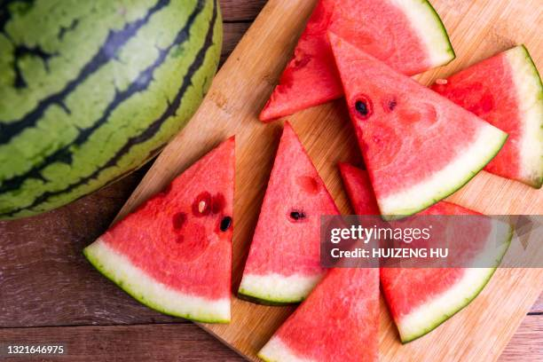

Pictures
All the core Markdown constructs in GitHub Flavored MarkdownLinks to an external site.
Headings
Styling text
Quoting text
Quoting code
External Links (Link to another webpage)
Section links (Link to a header in the same .md file)
Relative links (Link to another .md file or an image in your repo. If linking to an image, encode it as a regular link rather than an image.)
Ordered and Unordered Lists
Task lists

# An all about me page

My name is Nathan Chang, I am a **third year student** at UCSD currently studying Mathematics and Computer Science.

One of my favorite quotes is from the Bhagavad Gita, attributed to J Robert Oppenheimer in the construction of the atomic bomb 

> "Now I am become Death, the destroyer of worlds"

My favorite command is `git commit` because I get to leave funny little messages a `-m` tag.

Here is a [link](https://github.com/joshnh/Git-Commands) to find some common commands used for git

Link to the all about me section: [Link Text](#an-all-about-me-page)

[Link to the photo of a watermelon CSE110-GitHub-Pages/watermelon.jpg]

In no particular order, some of my favorite fruit include
- Strawberries
- Apples
- Oranges

My list of least favorite fruit include:
1. Durian
2. Cantaloupe
3. Kiwi

My goals for this quarter are to
- [] Learn Software Engineering
- [] Pass my classes
- [x] Have a healthy sleep schedule

